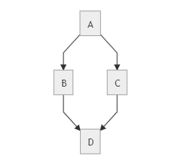

# Fluxtion service starter
A java utility for managing the deterministic execution of start and stop tasks for a directed acyclic graph  of 
interdependent services. 

Developer Guide available on **[GitHub pages](https://gregv12.github.io/fluxtion-service-starter/)** 

Tasks are triggered on a service when all its dependencies have successfully executed their tasks. Either an individual
services or all services can be started or stopped interactively. The topological order of managed services is 
calculated by the service starter to determine the execution order of tasks.

## The problem service starter solves
In many systems services execute independently but need to co-ordinate their lifecycle with each other. A service
may require all downstream services to be started before starting and becoming available to accept upstream requests. If
this order is not respected then unpredictable behaviour can occur, possibly resulting in application errors.

Similarly, if a downstream service becomes unavailable all upstream services will need to be notified and take appropriate
actions, gracefully shutting down services starting with external facing services and working back towards the failed
service.

As systems grow a complex graph of interdependent services quickly arises. The difficulty in correctly managing
lifecycle overwhelms a handwritten manual solution and can result in brittle non-deterministic behaviour that services
may rely upon.

Service starter is a utility that manages the lifecycle of independent services, executing start and stop tasks
associated with a particular service at the correct time.

## Sample graph

For the example above all services are in a stopped state and a request is made to start **A**. When the application is  running
events flow from **A** to **B** and **C** in parallel, then events are pushed to **D** from both **B** and **C**.

To start **A** ServiceManager produces the following outputs, and processes state change inputs from the application:

- ServiceManager produces task list with start task for **D**
- **D** completes task and sends a notification **D** has started successfully to the ServiceManager
- ServiceManager produces task list with **B** and **C** start tasks
- **B** completes task and sends a notification **B** has started successfully to the ServiceManager
- Service manager does nothing, as **C** has not started
- **C** completes task and sends a notification **C** has started successfully to the ServiceManager
- ServiceManager produces task list with start task for **A**
- **A** completes task and sends a notification **A** has started successfully to the ServiceManager
- ServiceManager produces no task list as there are no dependents on **A** to start

